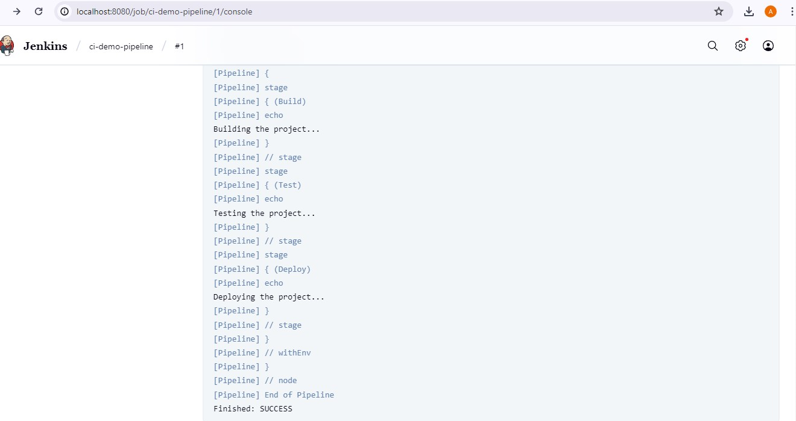

# Jenkins CI/CD Pipeline Demo

This project demonstrates a basic Jenkins pipeline for CI/CD using a `Jenkinsfile`.

## 🚀 Tools Used
- Jenkins
- GitHub
- Docker (for running Jenkins locally)


## 🧪 Pipeline Stages

The Jenkins pipeline includes 3 basic stages:

1. **Build** – Simulates building the project  
2. **Test** – Simulates running tests  
3. **Deploy** – Simulates deployment process

Each stage is defined using declarative syntax in the Jenkinsfile and runs echo commands as placeholders.

## 📦 Jenkinsfile

```groovy
pipeline {
    agent any

    stages {
        stage('Build') {
            steps {
                echo 'Building the project...'
            }
        }

        stage('Test') {
            steps {
                echo 'Testing the project...'
            }
        }

        stage('Deploy') {
            steps {
                echo 'Deploying the project...'
            }
        }
    }
}


### 🖼️ Screenshot of Pipeline Output



> Or view it directly:  
[Click to view full screenshot](https://raw.githubusercontent.com/AlbiinShaji/ci-demo/main/pipeline-output.png)


